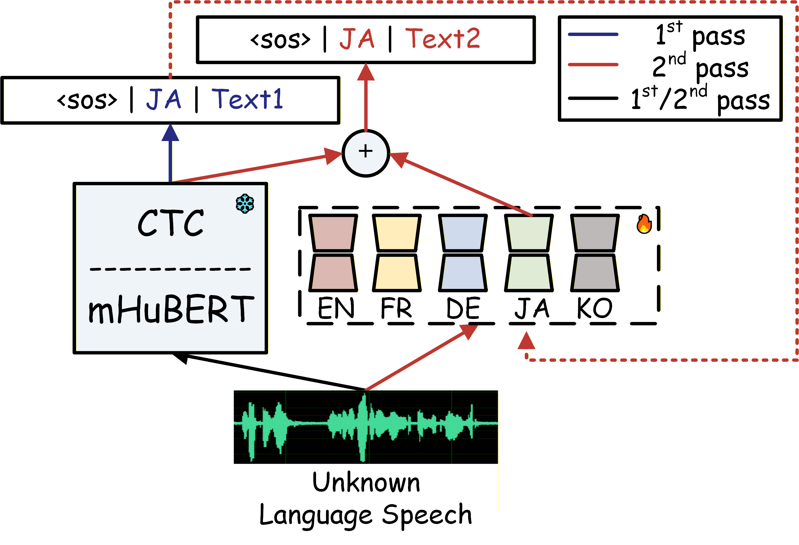
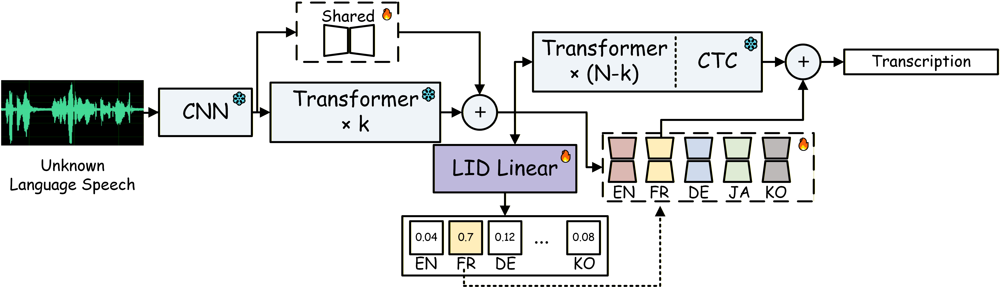

# A Language-Agnostic Hierarchical LoRA-MoE Architecture for CTC-based Multilingual ASR

This repository contains the official implementation of the following publications:

- A Language-Agnostic Hierarchical LoRA-MoE Architecture for CTC-based Multilingual ASR (available on [arxiv]())

# Introduction

### Two-stage inferece

Language agnostic decoding is achieved through a two-stage inference procedure. In the first stage, the base mHuBERT-CTC model without LoRA adaptation is used to predict an LID token via CTC decoding, and the language with the highest posterior probability is selected. In the second stage, the corresponding language-specific LoRA module is activated to perform ASR decoding. Although this two-stage approach enables language-agnostic decoding without prior LID information, it introduces additional inference latency and is susceptible to error propagation from language prediction to ASR. These limitations motivate a more efficient single-pass and end-to-end solution.

### Proposed HLoRA architeture

Fig. 2 illustrates the proposed mHuBERT-CTC-HLoRA architecture. An unknown-language speech is processed by a frozen CNN front-end and an N-layer Transformer encoder from the pretrained mHuBERT-147 model. To balance cross-lingual sharing and language-specific modeling, the encoder is divided into two parts: the lower k layers incorporate a shared LoRA optimized across all languages to capture language-invariant acoustic representations, while the upper N-k layers employ language-specific LoRA modules to model discriminative language-dependent characteristics. The intermediate representation after the k-th layer is fed into a lightweight LID classifier, whose posterior dynamically activates the corresponding language-specific LoRA in the upper layers and the CTC head, thereby tightly coupling LID and ASR within a unified framework and enabling single-pass, language-agnostic decoding.

# Checkpoints

We've released checkpoints:

- the mHuBERT-CTC-HLoRA model (with best k): [HuggingFace](https://huggingface.co/yuangzheng/HLoRA/tree/main)

model details: k=9, HuBERT base architecture (95M parameters), LoRA and LID (7M parameters), 5 languages.

# Get started

- The proposed method is implemented using [ESPnet2](https://github.com/espnet/espnet). So please make sure you have [installed ESPnet](https://espnet.github.io/espnet/installation.html).

- The training code will be made publicly available after the acceptance of this paper. 
  `./espnet`

- To experiment, follow the [ESPnet's steps](https://espnet.github.io/espnet/espnet2_tutorial.html). You can implement HLoRA method by simply replacing run.sh from the command line with our run.sh. For example:
  `./run.sh --stage 10 --stop_stage 13`

# Data

For each dataset, we provide `utt_id`.

| Dataset | Language | Path | Hours |
|--------|----------|------|-------|
| MSR-86K | All (11) | `data/msr_86k/` | 1500 |
| MLC-SLM | English (Indian) | `data/mlc_slm/english_indian` | 100 |
| MLC-SLM | French | `data/mlc_slm/french` | 100 |
| MLC-SLM | German | `data/mlc_slm/german` | 100 |
| MLC-SLM | Japanese | `data/mlc_slm/japanese` | 100 |
| MLC-SLM | Korean | `data/mlc_slm/korean` | 100 |

# Result

<b>Table: Overall mASR results on the MLC-SLM 2025 datasets.</b> 
MSR-1500h and MLC-500h denote training data subsets selected from MSR-86K and MLC-SLM 2025, respectively. 
“√” and “×” indicate language-known and language-agnostic inference, while “single” and “double” denote single-pass and two-stage inference, respectively. 
For S1–S6, all systems share the same mHuBERT-147 backbone pretrained on 90k hours of multilingual data.
  

<table>
  <tr>
    <th rowspan="2">ID</th>
    <th rowspan="2">System</th>
    <th rowspan="2">Params (M)</th>
    <th rowspan="2">Training Data</th>
    <th rowspan="2">LID</th>
    <th rowspan="2">Inference</th>
    <th colspan="2">Evaluation Sets (WER %)</th>
  </tr>
  <tr>
    <th>MLC-dev</th>
    <th>MLC-test</th>
  </tr>

  <tr>
    <td>S1</td>
    <td rowspan="2">mHuBERT-CTC (baseline)</td>
    <td rowspan="2">97</td>
    <td>MSR-1500h</td>
    <td>×</td>
    <td>single</td>
    <td>44.5</td>
    <td>43.7</td>
  </tr>
  <tr>
    <td>S2</td>
    <td>MLC-500h</td>
    <td>×</td>
    <td>single</td>
    <td>22.5</td>
    <td>21.6</td>
  </tr>

  <tr>
    <td>S3</td>
    <td rowspan="2">mHuBERT-CTC-LIDLoRA</td>
    <td rowspan="2">107</td>
    <td rowspan="2">MLC-500h</td>
    <td>√</td>
    <td>single</td>
    <td>24.6</td>
    <td>23.0</td>
  </tr>
  <tr>
    <td>S4</td>
    <td>×</td>
    <td>double</td>
    <td><b>26.6</b></td>
    <td><b>24.8</b></td>
  </tr>

  <tr>
    <td>S5</td>
    <td rowspan="2">mHuBERT-CTC-HLoRA</td>
    <td rowspan="2">102</td>
    <td rowspan="2">MLC-500h</td>
    <td>√</td>
    <td>single</td>
    <td>26.0</td>
    <td>24.0</td>
  </tr>
  <tr>
    <td>S6</td>
    <td>×</td>
    <td>single</td>
    <td><b>26.3</b></td>
    <td><b>24.7</b></td>
  </tr>

  <tr>
    <td>S7</td>
    <td>Whisper-base</td>
    <td>74</td>
    <td>680,000h</td>
    <td>×</td>
    <td>single</td>
    <td>37.2</td>
    <td>35.4</td>
  </tr>

  <tr>
    <td>S8</td>
    <td>Whisper-small</td>
    <td>244</td>
    <td>680,000h</td>
    <td>×</td>
    <td>single</td>
    <td>29.7</td>
    <td>28.6</td>
  </tr>
</table>

<b>Table: mHuBERT-CTC-HLoRA ablation study with different k.</b> 
Language-wise results are reported on the MLC-dev / MLC-test in WER (%).
  

<table>
  <tr>
    <th>Language</th>
    <th>k = 1</th>
    <th>k = 3</th>
    <th>k = 6</th>
    <th>k = 9</th>
    <th>k = 11</th>
  </tr>

  <tr>
    <td>English</td>
    <td>40.5 / 48.1</td>
    <td>33.8 / 36.6</td>
    <td>29.0 / 26.6</td>
    <td>29.2 / <b>25.2</b></td>
    <td><b>28.9</b> / 25.3</td>
  </tr>

  <tr>
    <td>French</td>
    <td>26.6 / 33.9</td>
    <td>26.3 / 33.2</td>
    <td><b>26.1</b> / <b>31.7</b></td>
    <td>26.4 / 32.0</td>
    <td>26.3 / 32.2</td>
  </tr>

  <tr>
    <td>German</td>
    <td>61.2 / 54.3</td>
    <td>54.9 / 44.1</td>
    <td><b>39.1</b> / 32.9</td>
    <td>39.5 / <b>32.6</b></td>
    <td>39.8 / 33.4</td>
  </tr>

  <tr>
    <td>Japanese</td>
    <td>37.3 / 41.0</td>
    <td>32.6 / 37.0</td>
    <td><b>25.0</b> / 27.8</td>
    <td>25.5 / <b>23.6</b></td>
    <td>25.7 / 24.7</td>
  </tr>

  <tr>
    <td>Korean</td>
    <td>17.9 / 16.5</td>
    <td>17.5 / <b>16.0</b></td>
    <td><b>17.2</b> / 16.1</td>
    <td>17.7 / 16.6</td>
    <td>18.1 / 16.9</td>
  </tr>

  <tr>
    <td><b>Avg</b></td>
    <td>34.8 / 36.6</td>
    <td>31.3 / 32.1</td>
    <td><b>26.0</b> / 26.0</td>
    <td>26.3 / <b>24.7</b></td>
    <td>26.5 / 25.2</td>
  </tr>
</table>
